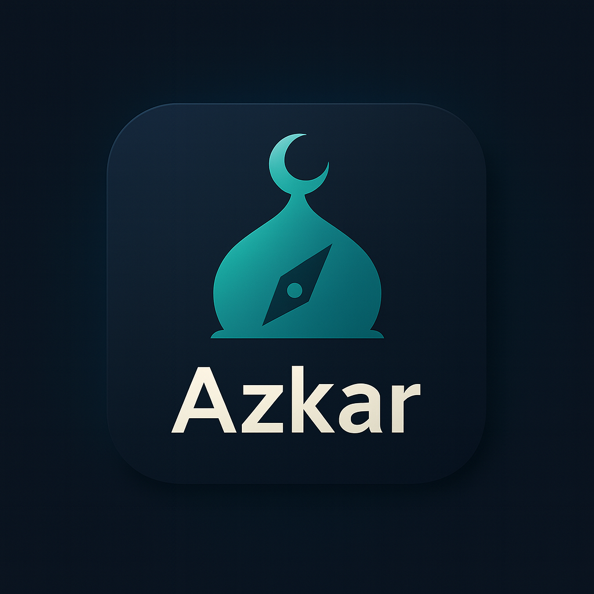
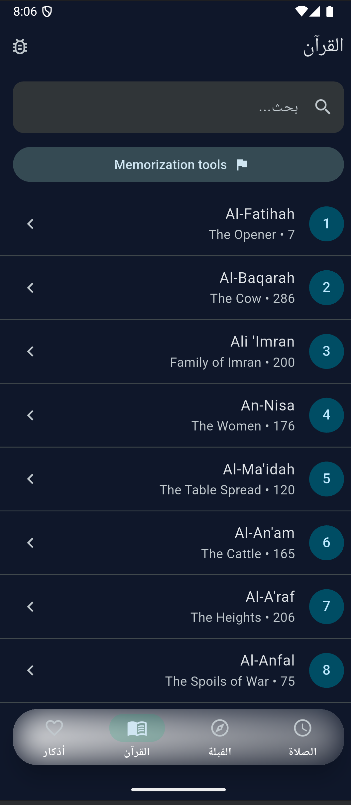

# Azkar 

Azkar is a cross-platform Flutter companion for daily adhkar, Qur’an reading, curated hadith collections, prayer schedules, Qiblah direction, appearance controls, and diagnostics tooling. The codebase follows a feature-first structure with strong localization and telemetry support.

---

## Highlights

- **Prayer toolbox** – device/fixed-location schedules, quiet hours, customizable per-prayer lead times, adhan voice previews, and notification snoozes.
- **Quran & collections** – Mushaf/tile readers, tafsir hooks, quick search, and shared collection reader for hadith/forties.
- **Appearance & telemetry** – theme seeds, text-scale preview, opt-in diagnostics with local log viewer/export.
- **Localization** – English + Arabic ARB files, RTL-aware UI, and generated localization delegates.

---

## Getting Started

### Requirements
- Flutter (stable channel) 3.19+
- Dart SDK (bundled with Flutter)
- Android/iOS toolchains as needed

### Setup
```bash
flutter pub get
dart format --output=none --set-exit-if-changed .
flutter analyze
flutter test
flutter run -d <device>   # e.g. chrome, ios, windows
```

### Release Builds
```bash
# Split APKs per ABI with obfuscation and debug symbols
flutter build apk --split-per-abi --obfuscate --split-debug-info=build/debug-info

# Google Play Bundle with identical optimizations
flutter build appbundle --obfuscate --split-debug-info=build/debug-info
```
Keep `build/debug-info` somewhere safe to de-obfuscate crash logs.

---

## Generated Sources
- **Localization:** edit `.arb` files under `lib/l10n/` or `l10n/`, then run `flutter gen-l10n`. Generated delegates live in `lib/l10n/app_localizations*.dart`.
- **Assets:** run `flutter pub run build_runner build --delete-conflicting-outputs` to regenerate `lib/generated/assets.gen.dart` (via `flutter_gen_runner`). Use the generated classes instead of hard-coded paths.

Both commands are idempotent—rerun them whenever you touch ARB files or asset manifests.

---

## Project Structure
| Path | Purpose |
| ---- | ------- |
| `lib/app/` | App bootstrap, router, permission gate |
| `lib/core/` | Services (location, notifications, telemetry, audio), domain entities/use-cases, theming |
| `lib/features/<feature>/` | Feature modules (prayer_times, quran, azkar, hadith, forties, settings, shared) |
| `lib/ui/widgets/` | Reusable decorative widgets (headers, splash, etc.) |
| `test/` | Mirrors `lib/` hierarchy for unit/widget tests |
| `docs/` | Roadmaps, delivery plans, troubleshooting notes |

See `AGENTS.md` and `docs/ROADMAP.md` for conventions and upcoming milestones.

---

## Telemetry & Diagnostics
- Users can opt into telemetry via the Appearance screen. When enabled, `TelemetryService` logs events/errors locally (never leaves the device).
- The “Diagnostics” screen (Settings → View Logs) lets you filter events/errors, copy logs to clipboard, or save them as text files for support.
- Notification scheduling, snoozes, location onboarding, and diagnostics actions emit structured telemetry to aid debugging.

---

## Automated screenshots

A simple integration test in `integration_test/screenshot_test.dart` renders the main tabs and saves PNGs under `assets/screenshots/`.

```bash
# Specify a device (desktop/web/emulator) to generate screenshots
flutter test integration_test/screenshot_test.dart -d windows
```

The test:
- Mocks the location onboarding flag so the app skips the permission gate
- Pumps the real `AzkarRoot` widget inside a `Screenshot` controller
- Navigates the bottom navigation bar (Prayer → Qiblah → Qur’an → Azkar)
- Writes PNG files (e.g., `assets/screenshots/prayer_home.png`)

Commit the updated PNGs to keep documentation/demo assets current.

---

## UI Gallery

<table>
  <tr>
    <td align="center" width="33%">
      
      <p><strong>Prayer Overview</strong><br/>Next prayer countdown, countdown cards, and quick actions.</p>
    </td>
    <td align="center" width="33%">
      
      <p><strong>Notification Controls</strong><br/>Per-prayer lead times, snooze, and quiet hours.</p>
    </td>
    <td align="center" width="33%">
      
      <p><strong>Qiblah Compass</strong><br/>Live heading guidance with calibration tips.</p>
    </td>
  </tr>
  <tr>
    <td align="center" width="33%">
      
      <p><strong>Quran Reader</strong><br/>Scroll, jump, and view translations within the Mushaf layout.</p>
    </td>
    <td align="center" width="33%">
      
      <p><strong>Azkar Hub</strong><br/>Curated adhkar categories with quick filters.</p>
    </td>
    <td align="center" width="33%">
      
      <p><strong>Appearance & Diagnostics</strong><br/>Theme palettes, typography preview, and telemetry toggle.</p>
    </td>
  </tr>
</table>

---

## CI/CD
GitHub Actions (`.github/workflows/flutter-ci.yml`) runs on every push/PR to `main`:
1. Checkout & install Flutter (stable channel, cached).
2. `flutter pub get`
3. `dart format --output=none --set-exit-if-changed .`
4. `flutter analyze`
5. `flutter test`

Only merge changes once the workflow passes.

---

## Contributing
1. Fork and clone the repo.
2. Follow the “Getting Started” + “Generated Sources” sections.
3. Keep changes focused; update relevant docs/tests.
4. Run `flutter test` locally before opening a PR.
5. Add screenshots or log exports when fixing UI/diagnostics issues.

Telemetry is opt-in; respect user privacy by never collecting PII or uploading logs automatically.

Happy building!
\n## Automated screenshots (WIP)\n
